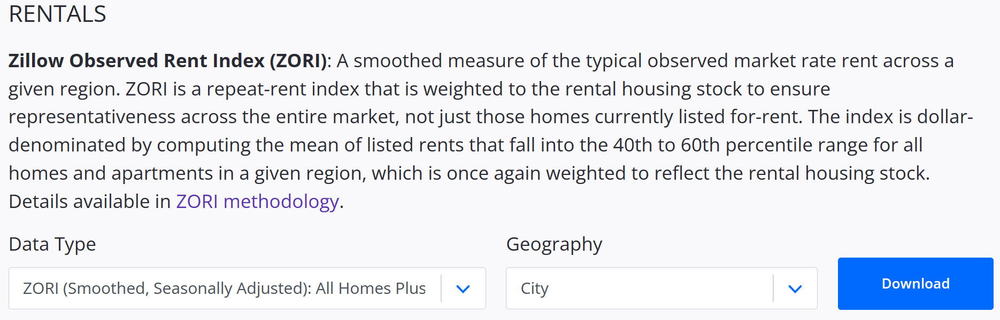

# Rental House Analysis (In Progress)

## Project Overview

This project aims to assist me in finding the ideal rental house as I plan to move. Balancing affordable rental prices and high quality of living is crucial. I can make an informed decision by evaluating factors such as rental prices, crime rates, living costs, and other metrics across different cities. Python will be used for data analysis, and interactive Tableau dashboards will visualize the results.
This project aims to find a suitable rental house by assessing various factors such as rentals, crime rates, living costs, and other related metrics. This project will leverage the power of Python for data analysis and utilize Tableau to visualize and communicate the insights derived from the analysis effectively.

#### Key Objectives:
- Gather data from diverse sources using Python, APIs, or web scraping tools.
- Analyze historical and current rental prices across different cities to identify trends.
- Investigate crime rates, living costs, weather patterns, and relevant factors to assess livability.
- Create interactive Tableau dashboards for effective presentation of insights.
- Make an informed decision about staying local or moving to other cities according to analysis results.

These objectives ensure a thorough analysis of rental prices, livability factors, and trends, enabling an informed decision about the ideal rental house that aligns with my requirements. The project aims to determine whether staying in my current location or relocating to other cities is the best choice for my rental housing needs.

## Results

In this data analyst portfolio project, I analyzed a dataset of [describe the dataset briefly]. The project aimed to [state the project objectives briefly]. By utilizing [mention key technologies and methodologies], I conducted data cleaning, exploration, and modeling to extract insights and solve [the problem or question being addressed]. The project resulted in [highlight key findings or outcomes].

## Challenges and Limitations

Throughout the project, the following challenges and limitations were encountered:

## Data Collection

#### Rental Prices Data:

The 'zillow_observed_rent_index.csv' file is obtained from [Housing Data - Zillow Research](https://www.zillow.com/research/data/). It provides region names, states, and ZORI values from March 2011 to May 2023, capturing the rental market trends.

To access and download this file, please refer to the image below. It showcases the location and necessary options for selection, along with a detailed explanation of the included time series data. For a more comprehensive understanding, please refer to the [ZORI methodology](https://www.zillow.com/research/methodology-zori-repeat-rent-27092/) for additional information. 

***

*** 
 

#### Crime Rates Data:

## Methodology

Data collection: Gather rental price data, crime rate data, and other relevant metrics from reliable sources.
Data cleaning: Preprocess and clean the datasets to ensure data quality and consistency.
Data exploration: Analyze the rental price trends, crime rates, and other factors to identify patterns and insights.
Data visualization: Utilize Python libraries to create visualizations that effectively communicate the findings.
Dashboard creation: Build an interactive dashboard using Tableau to present the analyzed data and insights.
- Utilize Python for data analysis and visualization to gain insights into the rental market.
- Create a Tableau dashboard to present the findings in an interactive and visually appealing manner.

## Future Enhancements

